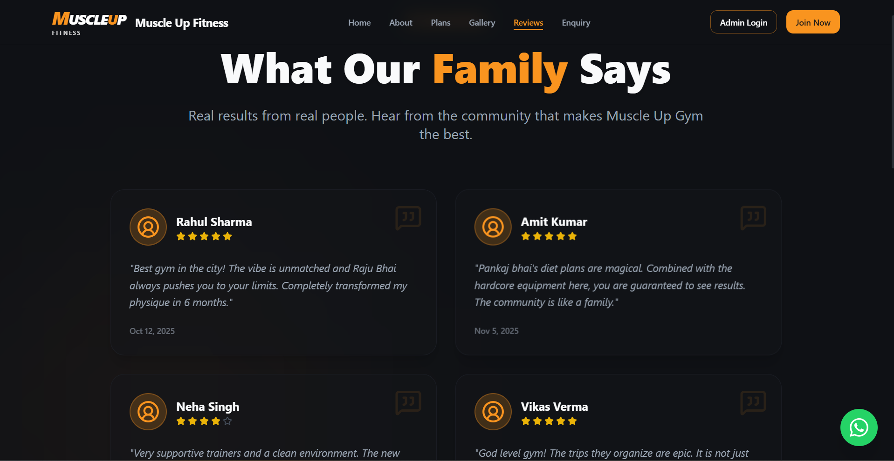
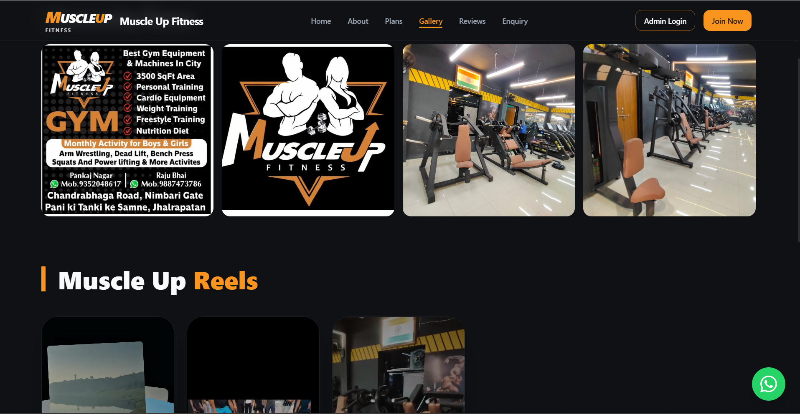
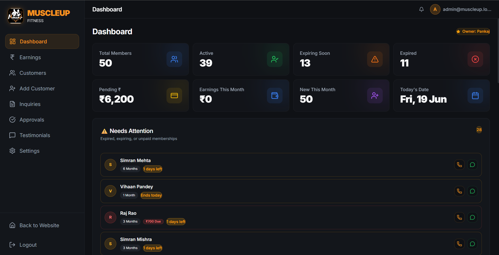
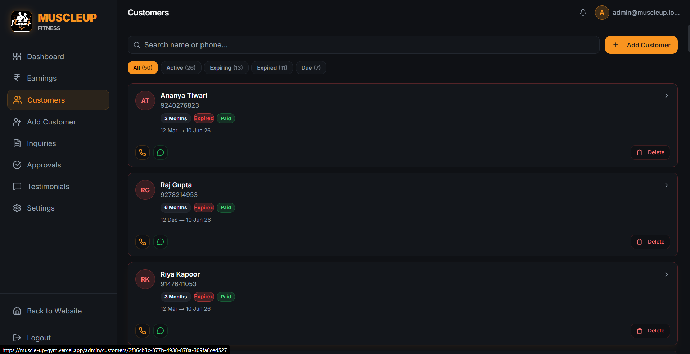
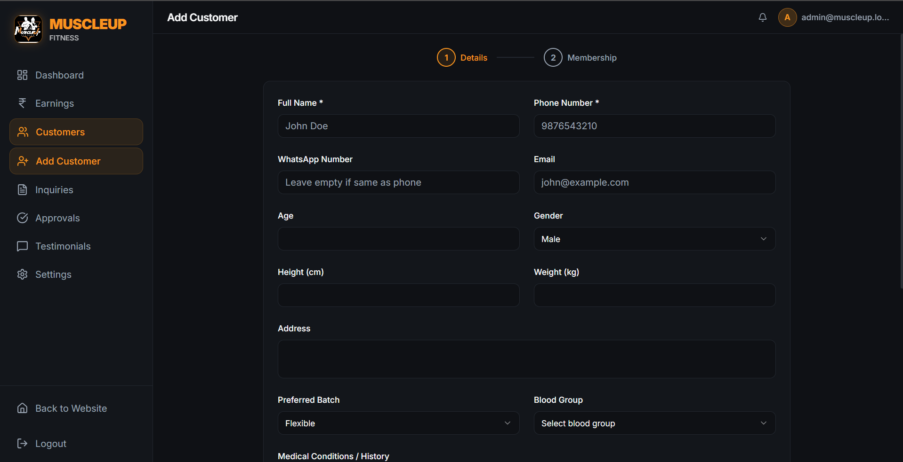
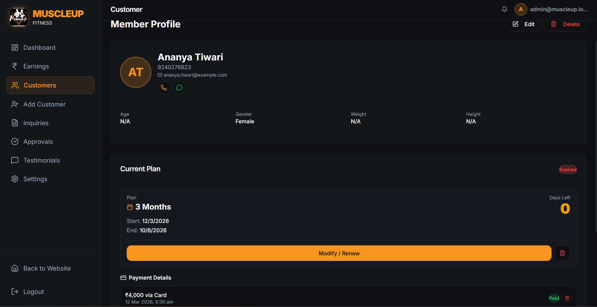
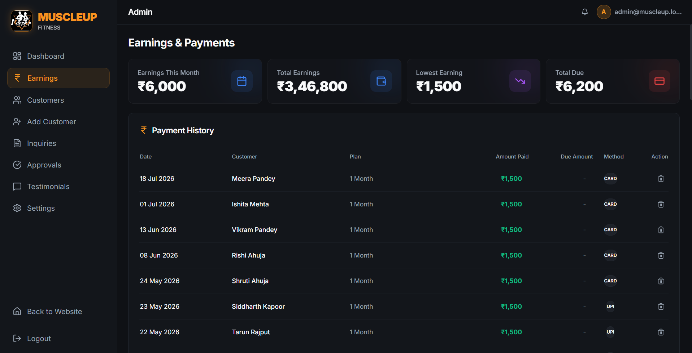
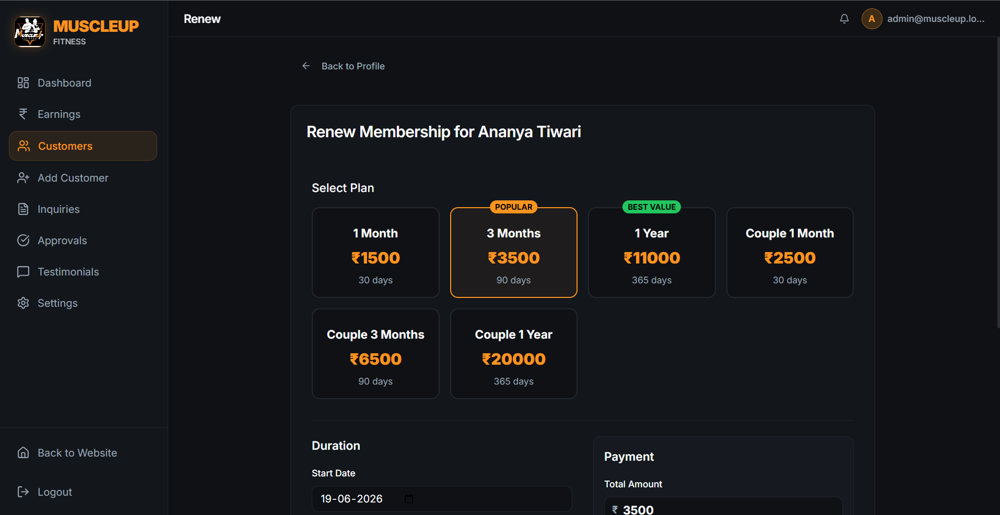

<div align="center">


# 💪 MuscleUp Gym — Management System

### A full-stack, production-grade gym management platform built for real business operations.

[](https://muscle-up-gym.vercel.app/)
[](https://github.com/gitkrypton18/Muscle-Up-Gym)
[](LICENSE)
[](https://react.dev/)
[](https://supabase.com/)
[](https://vitejs.dev/)
[](https://tailwindcss.com/)
[](https://muscle-up-gym.vercel.app/)

<br/>

> **MuscleUp Gym Management System** is a complete, real-world admin panel built to run an entire gym business — from member onboarding to payment tracking, renewals, leads, and WhatsApp automation. Designed with a premium dark-mode UI, it provides everything a gym owner needs in one clean, fast interface.

<br/>

---

</div>

## 📸 Screenshots

### How to attach images to this README
If you want to add screenshots to this file on GitHub:
1. Open this `README.md` file on GitHub and click the **Edit** (pencil) icon.
2. Simply **drag and drop** your image file directly into the editor text box.
3. GitHub will automatically upload the image and generate a markdown link for you (it looks like ``).
4. Replace the `[Drag & Drop Screenshot Here]` text below with that generated link!

### Public Website
*Experience the vibe with our God-Level 3D interface.*

| Home Page | About & Masters |
|:---:|:---:|
|  |  |
| *Hero section with auto-playing video* | *Meet the Masters profile cards* |

| Testimonials | Plans & Pricing |
|:---:|:---:|
|  |  |
| *Real success stories from the community* | *Dynamic pricing synced from Admin* |

| Enquiry Form | Gallery |
|:---:|:---:|
|  |  |
| *Sleek 3D lead generation form* | *Publicly uploaded photos and reels* |

### Admin Dashboard
*The MuscleUp Admin Dashboard handles all business operations securely behind the scenes. It features real-time metrics, automated WhatsApp reminders, and complete member management.*

| Secure Login | Dashboard |
|:---:|:---:|
|  |  |
| *Protected admin portal* | *KPI stats and alert panel* |

| Customers Directory | Add Customer Flow |
|:---:|:---:|
|  |  |
| *Real-time search and filtering* | *Multi-step enrollment form* |

| Customer Profile | Earnings & Analytics |
|:---:|:---:|
|  |  |
| *Payment history and WhatsApp integration* | *Monthly revenue and cash flow tracking* |

| Gym Settings & Plans | |
|:---:|:---:|
|  | |
| *Admin settings for public site syncing* | |

---

## ✨ Features

<table>
<tr>
<td width="50%">

### 🌐 Public Portfolio Website
- **God-Level 3D UI:** Stunning dark-mode aesthetics, Framer Motion animations, glassmorphism, and dynamic video backgrounds.
- **Dynamic Syncing:** The website automatically pulls Gym Timings, Address, Plans, and Manager Contacts directly from the Admin Dashboard. No hardcoding required!
- **Hybrid Approval System:** Customers can upload their own gym photos, videos, and testimonials. They go to a "Pending" state in the Admin Dashboard and only appear on the public Gallery/Testimonials pages once an Admin clicks "Approve".
- **Responsive Design:** Completely optimized for both desktop and mobile viewing with perfect grid snapping and scroll-to-top routing.

### 🔐 Authentication & Security
- Supabase email/password auth with JWT sessions
- Admin-only route guard (`ProtectedRoute`)
- **Forgot Password** flow with phone-number verification gate
- Dual password-reset strategy (live session or magic-link email)

### 📊 Real-Time Dashboard
- **8 live KPI stat cards**: Total Members, Active, Expiring Soon, Pending Payments, etc.
- **⚠️ Needs Attention** panel — surfaces expired and unpaid members instantly
- One-tap WhatsApp reminders straight from the dashboard

</td>
<td width="50%">

### 👥 Member Management
- Full CRUD: Add, View, Edit, Soft-Delete members
- **Couple Membership support** — link two members to a shared plan, split-card display
- Real-time search by name or phone
- Initials avatar auto-generated from member name

### 💳 Payments & Renewals
- Record full or partial payments on enrollment
- Track **due amounts** per member
- Renew membership with plan change, date override, and payment recording
- Monthly earnings aggregation (collected this month)

### 📱 WhatsApp Automation & Leads
- Pre-filled WhatsApp message templates per member
- Dynamic injection of: member name, days remaining, due amount
- Convert leads to full members in one click

### ⚙️ Settings & Admin Tools
- Change admin password (authenticated)
- **Community Approvals Tab:** 1-click approve or reject customer photo/video/review uploads.
- **Testimonials Manager:** Delete approved testimonials or manually add new ones bypassing the public form.
- Gym info editor (name, address, phone, timings) dynamically syncs to the public site footer and contact pages.

</td>
</tr>
</table>

---

## 🏗️ Tech Stack

| Layer | Technology | Version |
|-------|-----------|---------|
| **Frontend Framework** | React | `^19.2` |
| **Build Tool** | Vite | `^8.0` |
| **Backend / Database** | Supabase (PostgreSQL + Auth + Storage) | `^2.108` |
| **Styling** | Tailwind CSS | `^3.4` |
| **Component Library** | shadcn/ui (Radix UI primitives) | Latest |
| **Animations** | Framer Motion | `^12.4` |
| **Icons** | Lucide React | `^1.21` |
| **Routing** | React Router DOM | `^7.18` |
| **Deployment** | Vercel | — |

---

## 📁 Project Structure

```
muscle-up-gym/
│
├── public/                         # Static assets
├── screenshots/                    # 📸 Screenshots (add yours here)
│   ├── pages/                      # Full-page screenshots
│   │   └── 01-login.png            # Naming: NN-page-name.png
│   └── features/                   # Feature/component screenshots
│
├── src/
│   ├── assets/                     # Images (gym logo, business photo)
│   ├── components/
│   │   ├── layout/
│   │   │   └── AdminLayout.jsx     # Sidebar + top nav shell
│   │   ├── shared/
│   │   │   ├── ActionButtons.jsx   # Call + WhatsApp buttons
│   │   │   ├── ErrorBoundary.jsx   # Global error fallback
│   │   │   ├── ExpiryBadge.jsx     # Color-coded expiry tag
│   │   │   ├── LoadingSpinner.jsx  # Full-screen loader
│   │   │   └── StatCard.jsx        # KPI metric card
│   │   └── ui/                     # shadcn/ui primitives
│   │
│   ├── context/
│   │   └── AuthContext.jsx         # Auth state + signIn/signOut
│   │
│   ├── hooks/
│   │   ├── useCustomers.js         # Members CRUD
│   │   ├── useGymSettings.js       # Gym info (localStorage)
│   │   ├── useLeads.js             # Leads pipeline
│   │   ├── useMemberships.js       # Membership records
│   │   ├── usePayments.js          # Payment records
│   │   └── useStats.js             # Dashboard aggregations
│   │
│   ├── lib/
│   │   ├── supabase.js             # Supabase client init
│   │   └── utils.js                # Formatters, calculators, WA templates
│   │
│   ├── pages/admin/
│   │   ├── LoginPage.jsx           # Login + ForgotPassword modal
│   │   ├── DashboardPage.jsx       # KPI + Attention panel
│   │   ├── CustomersPage.jsx       # Member directory + filters
│   │   ├── AddCustomerPage.jsx     # New member enrollment
│   │   ├── CustomerDetailPage.jsx  # Member profile + history
│   │   ├── EditCustomerPage.jsx    # Edit member info
│   │   ├── RenewMembershipPage.jsx # Membership renewal
│   │   ├── LeadsPage.jsx           # Prospects pipeline
│   │   └── SettingsPage.jsx        # Admin settings
│   │
│   ├── App.jsx                     # Router + Auth Provider
│   ├── main.jsx                    # React entry point
│   └── index.css                   # Global styles + Tailwind tokens
│
├── .env.example                    # Required env vars template
├── vite.config.js                  # Vite + PWA config
├── tailwind.config.js              # Theme tokens
└── package.json
```

---

## 🗄️ Database Schema (Supabase)

```sql
-- Core Tables
customers       (id, name, phone, whatsapp, email, gender, partner_id, is_deleted, created_at)
memberships     (id, customer_id, plan_name, start_date, end_date, status, created_at)
payments        (id, customer_id, membership_id, amount, due_amount, payment_date, mode)
leads           (id, name, phone, interest, status, notes, created_at)

-- Database Views
active_members  → joins customers + memberships (used for CSV export & stats)
```

> Row Level Security (RLS) is enforced via Supabase Auth — only authenticated admin sessions can read/write data.

---

## 🚀 Getting Started

### Prerequisites

- [Node.js](https://nodejs.org/) ≥ 18
- [npm](https://www.npmjs.com/) or [pnpm](https://pnpm.io/)
- A [Supabase](https://supabase.com/) project (free tier works)

### 1. Clone the Repository

```bash
git clone https://github.com/gitkrypton18/Muscle-Up-Gym.git
cd Muscle-Up-Gym
```

### 2. Install Dependencies

```bash
npm install
```

### 3. Configure Environment Variables

```bash
cp .env.example .env
```

Edit `.env` and fill in your Supabase credentials:

```env
VITE_SUPABASE_URL=https://your-project.supabase.co
VITE_SUPABASE_ANON_KEY=your_anon_key_here
```

> ⚠️ **Never commit your `.env` file.** It is already in `.gitignore`.

### 4. Set Up the Database

1. Go to your [Supabase Dashboard](https://app.supabase.com/)
2. Open the **SQL Editor**
3. Run the schema SQL to create the `customers`, `memberships`, `payments`, and `leads` tables
4. Enable **Row Level Security** and add policies for authenticated users

### 5. Create Admin User

In Supabase Dashboard → **Authentication → Users**, create a user:
- Email: `admin@muscleup.local`
- Password: *(your secure password)*

### 6. Run Locally

```bash
npm run dev
```

Open [http://localhost:5173](http://localhost:5173) and log in with your admin credentials.

---

## ☁️ Deployment (Vercel)

This project is deployed on **Vercel** for zero-config, automatic CI/CD.

### One-Click Deploy

[](https://vercel.com/new/clone?repository-url=https://github.com/gitkrypton18/Muscle-Up-Gym)

### Manual Deploy Steps

1. Push your code to GitHub
2. Go to [vercel.com](https://vercel.com/) → **New Project** → Import your repo
3. Set the **Framework Preset** to `Vite`
4. Add **Environment Variables**:
   ```
   VITE_SUPABASE_URL     = https://your-project.supabase.co
   VITE_SUPABASE_ANON_KEY = your_anon_key
   ```
5. Click **Deploy** → Done! 🎉

After deploying, add your Vercel URL to Supabase:
- **Authentication → URL Configuration → Site URL** → `https://your-app.vercel.app`
- **Authentication → Redirect URLs** → `https://your-app.vercel.app/**`

---

## ⏰ Keep Supabase Alive (Auto-Ping)

Supabase pauses free-tier databases after 7 days of inactivity. This repository includes a GitHub Action (`.github/workflows/keep-alive.yml`) that automatically pings your database every 2 days to prevent it from sleeping.

**To enable this:**
1. Go to your GitHub repository → **Settings** → **Secrets and variables** → **Actions**
2. Add the following **Repository Secrets**:
   - `VITE_SUPABASE_URL`: *(Your Supabase URL)*
   - `VITE_SUPABASE_ANON_KEY`: *(Your Supabase Anon Key)*
3. Go to the **Actions** tab, select **Keep Supabase Alive**, and click **Run workflow** to test it!

---

## 🔐 Forgot Password Flow

A phone-gated identity verification system was built directly into the login page — no email required to start the process.

```
Login Page
    │
    └── Click "Forgot Password?"
            │
            ▼
    ┌─────────────────────────────┐
    │  Step 1: Phone Verification  │
    │  Enter: 9352048617           │
    └──────────────┬──────────────┘
                   │ ✓ Match
                   ▼
    ┌─────────────────────────────┐
    │  Step 2: Identity Revealed   │
    │  • Admin Email shown         │
    │  • Admin User ID shown       │
    │  • Set new password form     │
    └──────────────┬──────────────┘
                   │
                   ▼
    ┌─────────────────────────────┐
    │  Step 3: Reset Complete      │
    │  Direct update (if session)  │
    │  OR magic-link email sent    │
    └─────────────────────────────┘
```

---

## 📜 Available Scripts

| Command | Description |
|---------|-------------|
| `npm run dev` | Start development server on `localhost:5173` |
| `npm run build` | Build production bundle to `dist/` |
| `npm run preview` | Preview production build locally |
| `npm run lint` | Run ESLint across the project |

---

## 🗺️ Roadmap

- [ ] 📲 Push notifications for expiring memberships
- [ ] 📊 Advanced analytics & revenue charts (monthly/yearly)
- [ ] 🖨️ Invoice / receipt PDF generation per payment
- [ ] 👤 Multiple staff roles (Trainer, Receptionist)
- [ ] 📷 Member profile photo upload
- [ ] 🌐 Multi-gym / branch support
- [ ] 📱 Native mobile app (React Native)

---

## 🤝 Contributing

Contributions, issues, and feature requests are welcome!

1. Fork the repository
2. Create a feature branch: `git checkout -b feat/amazing-feature`
3. Commit your changes: `git commit -m 'feat: add amazing feature'`
4. Push to the branch: `git push origin feat/amazing-feature`
5. Open a Pull Request

Please follow [Conventional Commits](https://www.conventionalcommits.org/) for commit messages.

---

## 👨‍💻 Developer

<div align="center">


**Kalpit Nagar**

*Full-Stack Developer · React · Node.js · Supabase*

[](https://github.com/gitkrypton18)
[](https://linkedin.com/in/kalpitnagar312)
[](mailto:kalpitnagar312@gmail.com)

</div>

---

## 📄 License

This project is licensed under the **MIT License** — see the [LICENSE](LICENSE) file for details.

---

<div align="center">

**⭐ Star this repo if it helped you! It keeps the motivation going.**

Made with ❤️ and ☕ by [Kalpit Nagar](https://github.com/gitkrypton18) © 2026

</div>
